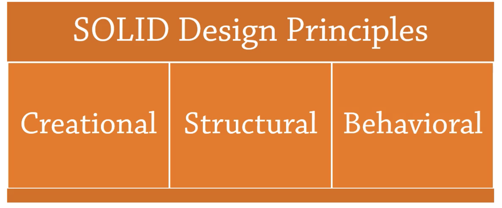
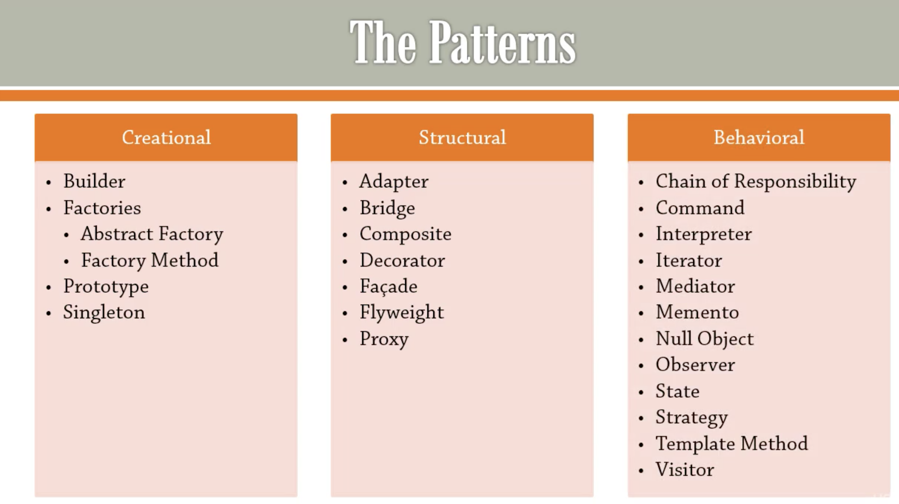

# dot-net-design-pattern
## About The Repository
Dotnet Design Pattern Practice with C#

## Design Pattern 

## IDE:
- Visual Studio 2019

## Contributing

Pull requests are welcome. For major changes, please open an issue first to discuss what you would like to change.

Please make sure to update tests as appropriate.